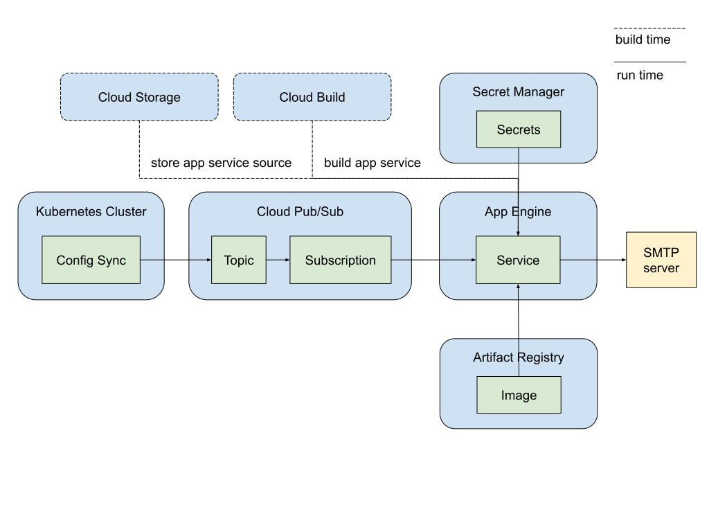

# Send email notifications for Config Sync Post-Sync Events

This example demonstrates how to send email notifications for Config Sync
post-sync events using Pub/Sub and App Engine.

## Architecture Overview

The diagram below showcases how Config Sync users can leverage a suite of Google
Cloud services to send email notifications for post-sync events.
This integrated solution utilizes:

- **Pub/Sub**: A real-time messaging service that enables Config Sync to publish
  post-sync events as messages to a designated topic.
- **Cloud App Engine**: Serverless app that execute code in response to
  events. In this setup, an app acts as the subscriber, receiving
  and processing events from the Pub/Sub topic to send email notifications.
- **Cloud Build**: A service that automates the build process for the app,
  packaging the code into a container image.
- **Artifact Registry**: A secure, private container registry that stores the
  built container image for the app.
- **Cloud Storage**: A scalable object storage service used to store the source
  code of the app.
- **Secret Manager**: A secure service for managing sensitive credentials, such
  as email account passwords, used by the app.



This architecture provides a robust and automated solution for sending email
notifications based on Config Sync events. It leverages the strengths of various
Google Cloud services to create a scalable, reliable, and secure event-driven
workflow.

## Before you begin

1. **Google Cloud Project**: Create a Google Cloud project.
2. **Billing**: Enable billing for your project.
3. **Email Account**: Prepare an email account with credentials for SMTP
   authentication. Gmail users can create app passwords by following these
   instructions:
   [Sign in with app passwords](https://support.google.com/mail/answer/185833).
4. **Project Owner**: You need to be the project owner to run the script.
5. **app-engine-go component**: The component [app-engine-go] is required for
   staging this application. If Google Cloud CLI component manager is disabled,
   run the following command to achieve the same result:
   ```bash
   sudo apt-get install -y google-cloud-cli-app-engine-go
   ```

## Running the Demo

To test the end-to-end solution, run the script with 3 required environment
variables.

```bash
export GCP_PROJECT=your-gcp-project-id
export MAIL_USERNAME=your-email-username
export MAIL_PASSWORD=your-email-password

sudo apt-get install -y google-cloud-cli-app-engine-go
./send-email-demo.sh
```

## Verifying the result

- **Email**: Upon successful execution, an email will be sent to
  `cs-pubsub-test@google.com`. Check this account for the received email or the
  sender account for the sent email.
- **Logs**: Inspect the App Engine service logs for the `Mail sent successfully`
  message.

## Under the hood

The `send-email-demo.sh` script performs the following steps:

1. Enable required APIs

1. Create a Kubernetes cluster

1. Install Config Sync

1. Create secrets in Secret Manager

1. Create and deploy the app

1. Set up Pub/Sub
    1. Create a Pub/Sub topic
    1. Create a Pub/Sub subscription

1. Configure RootSync to publish Config Sync events to the Pub/Sub topic


### Required APIs

| Cloud Product     | API service                     | Usage                                                                                            |
|-------------------|---------------------------------|--------------------------------------------------------------------------------------------------|
| Artifact Registry | artifactregistry.googleapis.com | Stores the container images for the subscriber application.                                      |
| App Engine        | appengineflex.googleapis.com    | Provides the platform for deploying and running the application.                                 |
| Pub/Sub           | pubsub.googleapis.com           | Provides the messaging infrastructure for publishing and subscribing to events.                  |
| Kubernetes Engine | container.googleapis.com        | Provides the Kubernetes cluster where Config Sync is deployed.                                   |
| Compute Engine    | compute.googleapis.com          | Provides the virtual machines that make up the Kubernetes cluster's nodes.                       |
| Secret Manager    | secretmanager.googleapis.com    | Securely stores sensitive credentials, such as email passwords.                                  |

### Required IAM permissions
| Service Account                                                      | Role                               | Usage                                                                                                          |
|----------------------------------------------------------------------|------------------------------------|----------------------------------------------------------------------------------------------------------------|
| cs-app-deployer@${GCP_PROJECT}.iam.gserviceaccount.com               | roles/appengine.deployer           | Allows the service account to deploy App Engine applications.                                                  |
| cs-app-deployer@${GCP_PROJECT}.iam.gserviceaccount.com               | roles/appengine.serviceAdmin       | Grants the service account administrative access to the App Engine service.                                    |
| cs-app-deployer@${GCP_PROJECT}.iam.gserviceaccount.com               | roles/cloudbuild.builds.builder    | Grants Cloud Build the necessary permissions to build the application's container image.                       |
| cs-app-deployer@${GCP_PROJECT}.iam.gserviceaccount.com               | roles/iam.serviceAccountUser       | Allows the service account to impersonate other service accounts (if needed for the application).              |
| cs-app-deployer@${GCP_PROJECT}.iam.gserviceaccount.com               | roles/storage.objectCreator        | Allows the service account to create objects in Cloud Storage.                                                 |
| cs-app-deployer@${GCP_PROJECT}.iam.gserviceaccount.com               | roles/storage.objectViewer         | Allows the service account to view objects in Cloud Storage.                                                   |
| cs-app-deployer@${GCP_PROJECT}.iam.gserviceaccount.com               | roles/secretmanager.secretAccessor | Grants the service account access to secrets stored in Secret Manager.                                         |
| cs-app-deployer@${GCP_PROJECT}.iam.gserviceaccount.com               | roles/pubsub.viewer                | Allows the service account to view and pull messages from Pub/Sub subscriptions.                               |
| cs-app-deployer@${GCP_PROJECT}.iam.gserviceaccount.com               | roles/monitoring.metricWriter      | Grants the service account permissions to export service metrics.                                              |
| ${project_numer}-compute@developer.gserviceaccount.com               | roles/artifactregistry.reader      | Grants the Compute Engine default service account read access to the Artifact Registry repository.             |
| ${GCP_PROJECT}.svc.id.goog[config-management-system/root-reconciler] | roles/pubsub.publisher             | Grants the Config Sync root-reconciler's Kubernetes service account permission to publish messages to Pub/Sub. |


## Clean up

Delete the Google Cloud project to remove all associated resources.

## References
- [Use Pub/Sub with App Engine tutorial](https://cloud.google.com/appengine/docs/flexible/writing-and-responding-to-pub-sub-messages?tab=go)