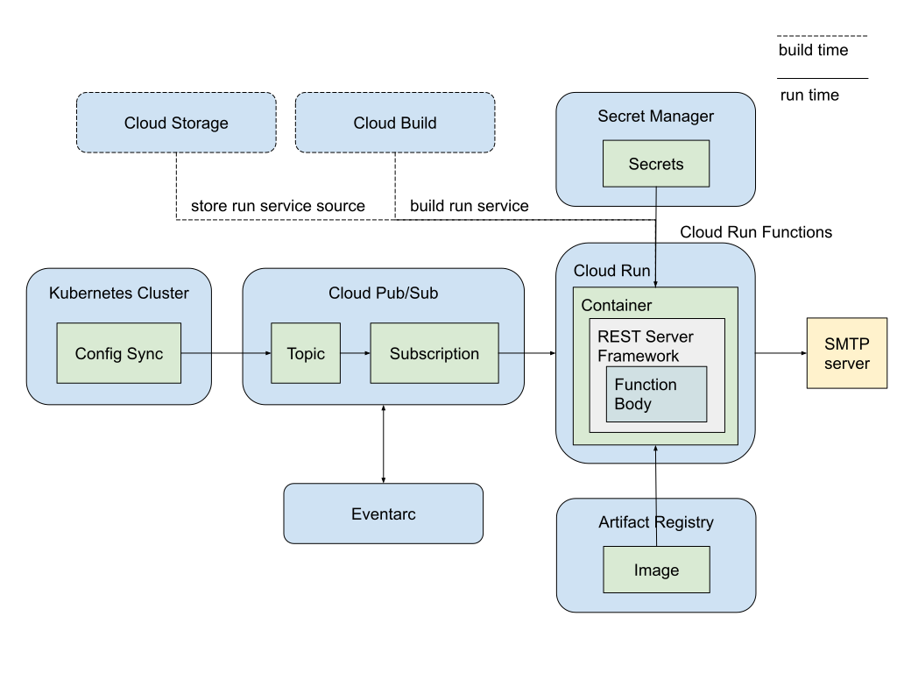

# Send email notifications for Config Sync Post-Sync Events

This example demonstrates how to send email notifications for Config Sync
post-sync events using Pub/Sub and Cloud Run Functions.

## Architecture Overview

The diagram below showcases how Config Sync users can leverage a suite of Google
Cloud services to send email notifications for post-sync events.
This integrated solution utilizes:

- **Pub/Sub**: A real-time messaging service that enables Config Sync to publish
  post-sync events as messages to a designated topic.
- **Cloud Run Functions**: Serverless functions that execute code in response to
  events. In this setup, a Cloud Run function acts as the subscriber, receiving
  and processing events from the Pub/Sub topic to send email notifications.
- **Cloud Run**: The underlying serverless platform that hosts and manages the
  Cloud Run functions.
- **Eventarc**: An event filtering and routing service that triggers the Cloud
  Run function based on specific Pub/Sub events.
- **Cloud Build**: A service that automates the build process for the Cloud Run
  function, packaging the code into a container image.
- **Artifact Registry**: A secure, private container registry that stores the
  built container image for the Cloud Run function.
- **Cloud Storage**: A scalable object storage service used to store the source
  code of the Cloud Run function.
- **Secret Manager**: A secure service for managing sensitive credentials, such
  as email account passwords, used by the Cloud Run function.



This architecture provides a robust and automated solution for sending email
notifications based on Config Sync events. It leverages the strengths of various
Google Cloud services to create a scalable, reliable, and secure event-driven
workflow.

## Before you begin

1. **Google Cloud Project**: Create a Google Cloud project.
2. **Billing**: Enable billing for your project.
3. **Email Account**: Prepare an email account with credentials for SMTP
   authentication. Gmail users can create app passwords by following these
   instructions:
   [Sign in with app passwords](https://support.google.com/mail/answer/185833).

## Running the Demo

To test the end-to-end solution, run the script with 3 required environment
variables.

```bash
export GCP_PROJECT=your-gcp-project-id
export MAIL_USERNAME=your-email-username
export MAIL_PASSWORD=your-email-password

./send-email-demo.sh
```

## Verifying the result

- **Email**: Upon successful execution, an email will be sent to
  `cs-pubsub-test@google.com`. Check this account for the received email or the
  sender account for the sent email.
- **Logs**: Inspect the Cloud Run Functions logs for the `Mail sent successfully`
  message.

## Under the hood

The `send-email-demo.sh` script performs the following steps:

1. Enable required APIs

1. Create a Kubernetes cluster

1. Install Config Sync

1. Create secrets in Secret Manager

1. Set up IAM permissions for Cloud Run Function

1. Deploy the function

1. Create a Pub/Sub topic

1. Configure RootSync to publish Config Sync events to the Pub/Sub topic


### Required APIs

| Cloud Product     | API service                     | Usage                                                                                            |
|-------------------|---------------------------------|--------------------------------------------------------------------------------------------------|
| Artifact Registry | artifactregistry.googleapis.com | Stores the container images for the subscriber application.                                      |
| Cloud Build       | cloudbuild.googleapis.com       | Builds the container image for the subscriber application.                                       |
| Pub/Sub           | pubsub.googleapis.com           | Provides the messaging infrastructure for publishing and subscribing to events.                  |
| Cloud Run         | run.googleapis.com              | Hosts and runs the subscriber application as a serverless service.                               |
| Kubernetes Engine | container.googleapis.com        | Provides the Kubernetes cluster where Config Sync is deployed.                                   |
| Compute Engine    | compute.googleapis.com          | Provides the virtual machines that make up the Kubernetes cluster's nodes.                       |
| Secret Manager    | secretmanager.googleapis.com    | Securely stores sensitive credentials, such as email passwords.                                  |
| Eventarc          | eventarc.googleapis.com         | Enables event filtering and routing, triggering Cloud Run services based on events.              |
| Cloud Functions   | cloudfunctions.googleapis.com   | Provides the serverless compute environment for executing the subscriber's event handling logic. |

### Required IAM permissions
| Service Account                                                      | Role                              | Usage                                                                                                          |
|----------------------------------------------------------------------|-----------------------------------|----------------------------------------------------------------------------------------------------------------|
| cs-function-builder@${GCP_PROJECT}.iam.gserviceaccount.com           | roles/cloudbuild.builds.builder   | Grants Cloud Build the necessary permissions to build the Cloud Function's container image.                    |
| cs-run-service-sa@${GCP_PROJECT}.iam.gserviceaccount.com             | run.invoker                       | Allows the Cloud Run service to invoke the Cloud Function.                                                     |
| cs-function-invoker@${GCP_PROJECT}.iam.gserviceaccount.com           | run.invoker                       | Allows Pub/Sub to invoke the Cloud Function in response to published messages.                                 |
| cs-run-service-sa@${GCP_PROJECT}.iam.gserviceaccount.com             | roles/ecretmanager.secretAccessor | Grants the Cloud Run service account access to secrets stored in Secret Manager.                               |
| {PROJECT_NUMBER}-compute@developer.gserviceaccount.com               | roles/artifactregistry.reader     | Grants the Compute Engine default service account read access to the Artifact Registry repository.             |
| ${GCP_PROJECT}.svc.id.goog[config-management-system/root-reconciler] | roles/pubsub.publisher            | Grants the Config Sync root-reconciler's Kubernetes service account permission to publish messages to Pub/Sub. |


## Clean up

Delete the Google Cloud project to remove all associated resources.

## References
- [Use Pub/Sub with Cloud Run tutorial](https://cloud.google.com/run/docs/tutorials/pubsub)