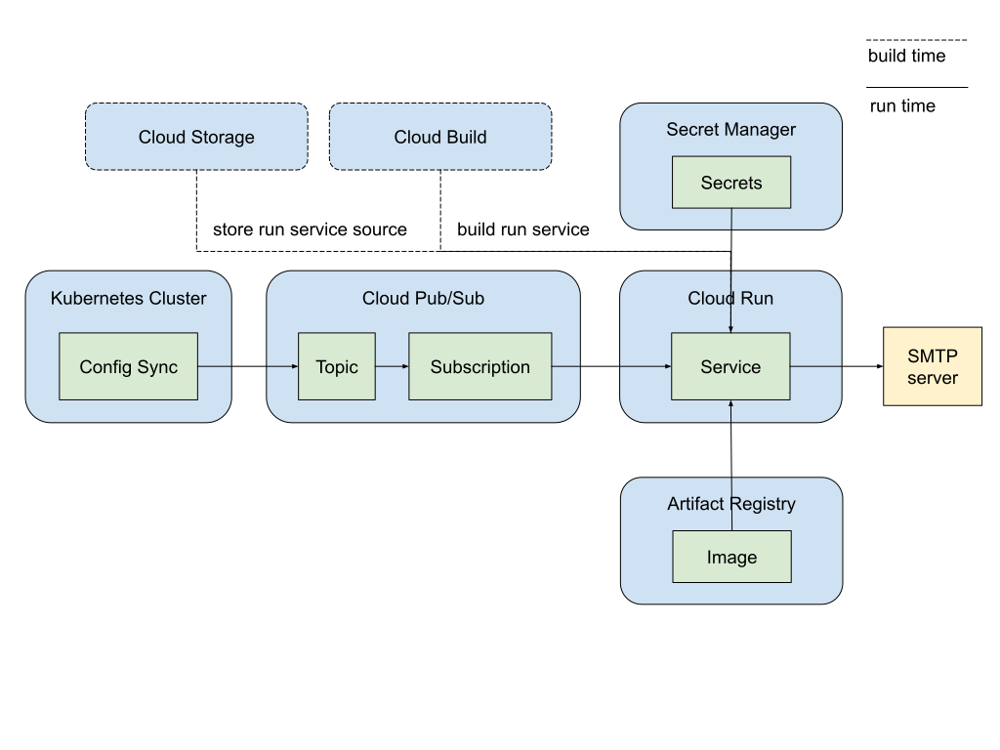

# Send email notifications for Config Sync Post-Sync Events

This example demonstrates how to send email notifications for Config Sync
post-sync events using Pub/Sub and Cloud Run.

## Architecture Overview

The following diagram illustrates how Config Sync users can leverage Google
Cloud services like Pub/Sub, Cloud Run, Cloud Build, Artifact Registry, Cloud
Storage, and Secret Manager to send email notifications.



This setup involves
- creating a Pub/Sub topic for Config Sync to publish post-sync events.
- A subscriber application, deployed on Cloud Run, subscribes to this topic to
  receive and process these events.
- Cloud Build builds the subscriber application, storing its source code in 
  Cloud Storage and its container image in Artifact Registry.
- Sensitive credentials are securely stored in Secret Manager.

## Before you begin

1. **Google Cloud Project**: Create a Google Cloud project.
2. **Billing**: Enable billing for your project.
3. **Email Account**: Prepare an email account with credentials for SMTP
   authentication. Gmail users can create app passwords by following these
   instructions:
   [Sign in with app passwords](https://support.google.com/mail/answer/185833).

## Running the Demo

To test the end-to-end solution, run the script with 3 required environment
variables.

```bash
export GCP_PROJECT=your-gcp-project-id
export MAIL_USERNAME=your-email-username
export MAIL_PASSWORD=your-email-password

./send-email-demo.sh
```

## Verifying the result

- **Email**: Upon successful execution, an email will be sent to 
  `cs-pubsub-test@google.com`. Check this account for the received email or the
  sender account for the sent email.
- **Logs**: Inspect the Cloud Run service logs for the `Mail sent successfully`
  message.

## Under the hood

The `send-email-demo.sh` script performs the following steps:

1. Enable required APIs

1. Create a Kubernetes cluster

1. Install Config Sync

1. Create secrets in Secret Manager

1. Set up Cloud Run
   1. Create a repository Artifact Registry
   1. Build and publish the run service
   1. Deploy the run service

1. Set up Pub/Sub
   1. Create a Pub/Sub topic
   1. Create a Pub/Sub subscription

1. Configure RootSync to publish Config Sync events to the Pub/Sub topic


### Required APIs

| Cloud Product     | API service                     | Usage                                                             |
|-------------------|---------------------------------|-------------------------------------------------------------------|
| Artifact Registry | artifactregistry.googleapis.com | Stores the subscriber application                                 |
| Cloud Build       | cloudbuild.googleapis.com       | Builds the subscriber application                                 |
| Pub/Sub           | pubsub.googleapis.com           | Serves as a real-time messaging service                           |
| Cloud Run         | run.googleapis.com              | Serves as a serverless platform to run the subscriber application |
| Kubernetes Engine | container.googleapis.com        | Runs Config Sync on Kubernetes clusters                           |
| Secret Manager    | secretmanager.googleapis.com    | Stores sensitive credentials securely                             |

### Required IAM permissions
| Service Account                                                      | Role                                 | Usage                                                               |
|----------------------------------------------------------------------|--------------------------------------|---------------------------------------------------------------------|
| cs-run-pubsub-invoker@${GCP_PROJECT}.iam.gserviceaccount.com         | roles/run.invoker                    | PubSub invoker to invoke the Cloud Run service                      |
| service-${project_numer}@gcp-sa-pubsub.iam.gserviceaccount.com       | roles/iam.serviceAccountTokenCreator | Allows Pub/Sub to create authentication tokens                      |
| cs-run-builder@${GCP_PROJECT}.iam.gserviceaccount.com                | roles/logging.logWriter              | Run builder to write logs when building the run service             |
| cs-run-builder@${GCP_PROJECT}.iam.gserviceaccount.com                | roles/run.sourceDeveloper            | Run builder to build a Run service from source code                 |
| cs-run-builder@${GCP_PROJECT}.iam.gserviceaccount.com                | roles/storage.admin                  | Run builder to store the service in Cloud Storage                   |
| cs-run-builder@${GCP_PROJECT}.iam.gserviceaccount.com                | roles/artifactregistry.writer        | Run builder to publish service container image to Artifact Registry |
| cs-run-identity@{GCP_PROJECT}.iam.gserviceaccount.com                | roles/ecretmanager.secretAccessor    | Run service identity to access secrets stored in Secret Manager     |
| {PROJECT_NUMBER}-compute@developer.gserviceaccount.com               | roles/artifactregistry.reader        | Compute Engine default service account to allow image pull          |
| ${GCP_PROJECT}.svc.id.goog[config-management-system/root-reconciler] | roles/pubsub.publisher               | Config Sync root-reconciler's KSA to publish messages to Pub/Sub    |

## Clean up

Delete the Google Cloud project to remove all associated resources.

## References
- [Use Pub/Sub with Cloud Run tutorial](https://cloud.google.com/run/docs/tutorials/pubsub)