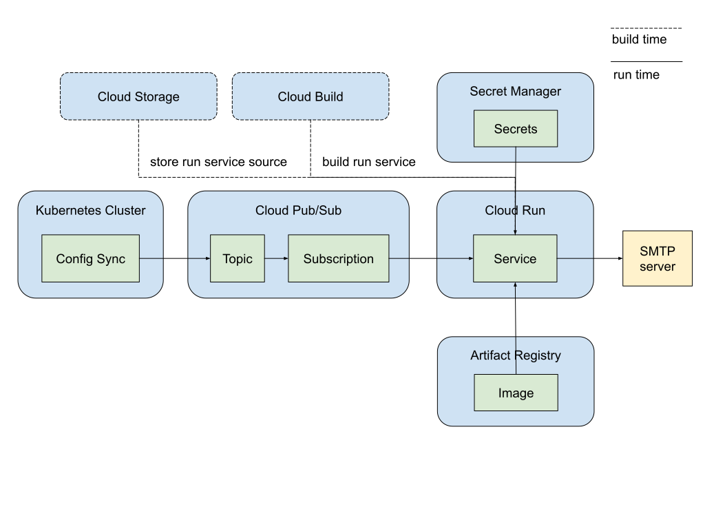

# Send email notifications for Config Sync Post-Sync Events

This example demonstrates how to send email notifications for Config Sync
post-sync events using Pub/Sub and Cloud Run.

## Architecture Overview

The diagram below illustrates how Config Sync users can integrate with various
Google Cloud services to send email notifications for post-sync events.
This setup utilizes:

- **Pub/Sub**: A messaging service that allows Config Sync to publish post-sync
  events as messages to a topic.
- **Cloud Run**: A serverless platform that hosts a subscriber application.
  This application subscribes to the Pub/Sub topic, receives events, and sends
  email notifications accordingly.
- **Cloud Build**: A service that automates the build process for the subscriber
  application.
- **Artifact Registry**: A repository for storing the container image of the
  subscriber application.
- **Cloud Storage**: A service for storing the source code of the subscriber
  application.
- **Secret Manager**: A secure service for storing sensitive credentials, such
  as email account passwords.



This architecture enables a seamless and automated workflow for sending email
notifications based on Config Sync events, leveraging the strengths of different
Google Cloud services.

## Before you begin

1. **Google Cloud Project**: Create a Google Cloud project.
2. **Billing**: Enable billing for your project.
3. **Email Account**: Prepare an email account with credentials for SMTP
   authentication. Gmail users can create app passwords by following these
   instructions:
   [Sign in with app passwords](https://support.google.com/mail/answer/185833).
4. **Project Owner**: You need to be the project owner to run the script.

## Running the Demo

To test the end-to-end solution, run the script with 3 required environment
variables.

```bash
export GCP_PROJECT=your-gcp-project-id
export MAIL_USERNAME=your-email-username
export MAIL_PASSWORD=your-email-password

./send-email-demo.sh
```

## Verifying the result

- **Email**: Upon successful execution, an email will be sent to 
  `cs-pubsub-test@google.com`. Check this account for the received email or the
  sender account for the sent email.
- **Logs**: Inspect the Cloud Run service logs for the `Mail sent successfully`
  message.

## Under the hood

The `send-email-demo.sh` script performs the following steps:

1. Enable required APIs

1. Create a Kubernetes cluster

1. Install Config Sync

1. Create secrets in Secret Manager

1. Set up Cloud Run
   1. Create a repository Artifact Registry
   1. Build and publish the run service
   1. Deploy the run service

1. Set up Pub/Sub
   1. Create a Pub/Sub topic
   1. Create a Pub/Sub subscription

1. Configure RootSync to publish Config Sync events to the Pub/Sub topic


### Required APIs

| Cloud Product     | API service                     | Usage                                                                |
|-------------------|---------------------------------|----------------------------------------------------------------------|
| Artifact Registry | artifactregistry.googleapis.com | Stores the container images for the Cloud Run service.               |
| Cloud Build       | cloudbuild.googleapis.com       | Builds the container image for the Cloud Run service.                |
| Pub/Sub           | pubsub.googleapis.com           | Provides the messaging service to connect Config Sync and Cloud Run. |
| Cloud Run         | run.googleapis.com              | Hosts and runs the service that sends email notifications.           |
| Kubernetes Engine | container.googleapis.com        | Provides the Kubernetes cluster where Config Sync is deployed.       |
| Compute Engine    | compute.googleapis.com          | Provides the virtual machines that make up the Kubernetes cluster.   |
| Secret Manager    | secretmanager.googleapis.com    | Securely stores sensitive credentials, such as email passwords.      |


### Required IAM permissions
| Service Account                                                      | Role                                 | Usage                                                                                                          |
|----------------------------------------------------------------------|--------------------------------------|----------------------------------------------------------------------------------------------------------------|
| cs-run-pubsub-invoker@${GCP_PROJECT}.iam.gserviceaccount.com         | roles/run.invoker                    | Grants Pub/Sub permission to invoke the Cloud Run service.                                                     |
| service-${project_numer}@gcp-sa-pubsub.iam.gserviceaccount.com       | roles/iam.serviceAccountTokenCreator | Allows Pub/Sub to create authentication tokens.                                                                |
| cs-run-builder@${GCP_PROJECT}.iam.gserviceaccount.com                | roles/logging.logWriter              | Allows the Cloud Build builder to write logs.                                                                  |
| cs-run-builder@${GCP_PROJECT}.iam.gserviceaccount.com                | roles/run.sourceDeveloper            | Allows the Cloud Build builder to build the Cloud Run service from source code.                                |
| cs-run-builder@${GCP_PROJECT}.iam.gserviceaccount.com                | roles/storage.admin                  | Grants the Cloud Build builder admin access to Cloud Storage.                                                  |
| cs-run-builder@${GCP_PROJECT}.iam.gserviceaccount.com                | roles/artifactregistry.writer        | Allows the Cloud Build builder to publish the service's container image to Artifact Registry.                  |
| cs-run-identity@{GCP_PROJECT}.iam.gserviceaccount.com                | roles/secretmanager.secretAccessor   | Grants the Cloud Run service account access to secrets stored in Secret Manager.                               |
| ${project_numer}-compute@developer.gserviceaccount.com               | roles/artifactregistry.reader        | Grants the Compute Engine default service account read access to Artifact Registry.                            |
| ${GCP_PROJECT}.svc.id.goog[config-management-system/root-reconciler] | roles/pubsub.publisher               | Grants the Config Sync root-reconciler's Kubernetes service account permission to publish messages to Pub/Sub. |
## Clean up

Delete the Google Cloud project to remove all associated resources.

## References
- [Use Pub/Sub with Cloud Run tutorial](https://cloud.google.com/run/docs/tutorials/pubsub)